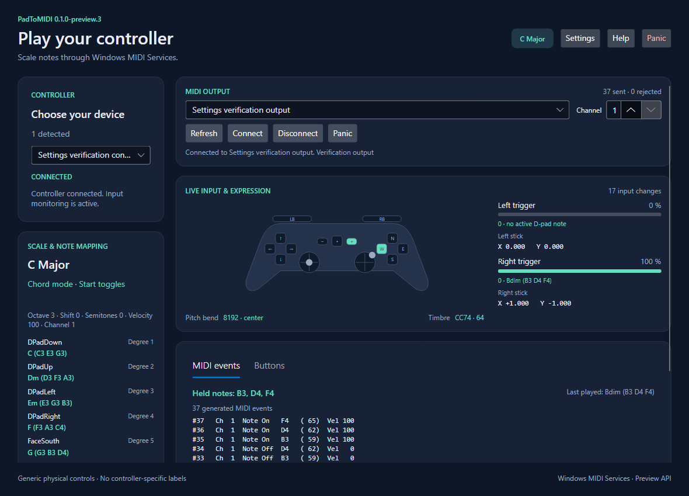

# PadToMIDI

Turn a standard game controller into an expressive MIDI instrument on Windows.
Play notes in a chosen scale, toggle chords with Start, and shape the sound with
triggers and sticks. Built with C#, .NET 10, Avalonia UI, SDL3, and Windows MIDI Services.



Interface preview using simulated controller input and a test MIDI destination.

## Download and run

Download the installer or portable ZIP from this repository's **Releases** page.
For the portable version, extract the ZIP and run `PadToMIDI/PadToMIDI.exe`.
The packaged application includes the .NET runtime.

Requirements:

- **Windows 11 25H2 or newer, x64**.
- Windows MIDI Services, plus a MIDI endpoint or loopback route to your DAW/synth.
- An SDL-supported controller connected by USB or Bluetooth.

Follow Microsoft's [Preview 10 setup instructions](https://github.com/microsoft/MIDI/releases/tag/inbox-preview-10)
for MIDI tools and transports. They are installed separately.
In PadToMIDI, select your controller and MIDI output, then click **Connect**.
Enable the receiving MIDI input and instrument monitoring in your DAW/synth.

The current version is **0.1.0-preview.3**: unsigned, using preview Windows MIDI APIs
and the pinned SDL 3.5.0 development binary. See [release notes](release/RELEASE-NOTES.md)
and [dependency conditions](docs/DEPENDENCIES.md).

## Default controls

Default profile: **C Major, octave 3, velocity 100, MIDI channel 1**. C4 is MIDI note 60.
Face positions are normalized so different controller brands share the same mappings.

| Control | Action |
| --- | --- |
| D-pad Down / Up / Left / Right | Scale degrees 1 / 2 / 3 / 4: C3 / D3 / E3 / F3 |
| Face South / North / West / East | Scale degrees 5 / 6 / 7 / 8: G3 / A3 / B3 / C4 |
| Start | Toggle single notes and scale-derived triads |
| Left stick Up / Down | Newly pressed notes one octave higher / lower while held |
| Left stick Left / Right | Decrease / increase persistent octave once; center to rearm |
| Left bumper / Right bumper | Flatten / sharpen newly pressed notes while held |
| Left trigger / Right trigger | Polyphonic aftertouch for the latest active D-pad / face note or chord |
| Right stick X | Pitch bend; center = 8192 |
| Right stick Y | Timbre, MIDI CC74; up = 127, center = 64, down = 0 |
| Panic / Ctrl+Shift+Esc | Release tracked notes and reset expression |
| F1 / Ctrl+, / Ctrl+Shift+P | Help / Settings / Profiles |

Held notes retain their exact release pitches when modifiers or settings change.
Disconnecting a controller, switching outputs, or shutting down performs note cleanup.
Input continues while another window has focus. D-pad combinations follow the hardware;
opposite-direction combinations are not required.

## Scales, chords, and profiles

Choose root, scale, base octave, velocity, channel, mappings, and expression settings.
Included scales: Major, Natural Minor, Harmonic Minor, Melodic Minor (ascending), Dorian,
Phrygian, Lydian, Mixolydian, Locrian, Major Pentatonic, Minor Pentatonic, Blues, and Chromatic.

Chord mode stacks scale thirds in seven-note scales. Pentatonic, blues, and chromatic
playing needs a selected seven-note harmony scale or an explicit chord shape.
See [chord mode and music theory](docs/CHORD-MODE.md).

Settings provides editable button/stick actions, source controls, dead zones, thresholds,
curves, inversion, smoothing, update rates, pitch bend, and timbre CC. **Apply** changes the
running setup; **Profiles** saves it. Create, save, load, duplicate, rename, delete, and
import/export human-readable JSON. The built-in Default C Major profile is read-only.

Profiles live in `%LOCALAPPDATA%\PadToMIDI\Profiles` and survive uninstall.
Profiles from the previous app name are copied on first launch without overwriting new
profiles or deleting originals. The last active profile restores on startup; MIDI output
connection remains manual. See [profile details](docs/MILESTONE-7.md).

## Build from source

Install the **.NET 10 SDK x64** (tested with 10.0.401), clone/download the source, and open
the repository root in Visual Studio Code. Visual Studio is not required.
Run these commands from that root in PowerShell:

```powershell
powershell -NoProfile -ExecutionPolicy Bypass -File tools/Restore-MidiSdk.ps1
dotnet restore PadToMIDI.sln --locked-mode
dotnet build PadToMIDI.sln -c Release --no-restore
dotnet test --project tests/PadToMIDI.Core.Tests -c Release --no-build --no-restore
dotnet test --project tests/PadToMIDI.App.Tests -c Release --no-build --no-restore
dotnet test --project tests/PadToMIDI.Midi.Windows.Tests -c Release --no-build --no-restore
dotnet run --project src/PadToMIDI.App -c Release --no-build --no-restore
```

The first command downloads Microsoft's official SDK into the ignored local NuGet feed
and verifies its SHA-256. Other dependencies restore from NuGet. SDL3 native binaries and
Windows reference metadata come from pinned packages; a separate Windows SDK is not required.

Use **F5** for Debug launch or **Ctrl+Shift+B** to build in VS Code. Tasks prepare the MIDI
SDK automatically. The GitHub CI workflow builds and runs hardware-independent tests.
For installer/ZIP generation and isolated verification, see [packaging](docs/MILESTONE-8.md).
For repository upload and release assets, see [GitHub release preparation](docs/GITHUB-RELEASE.md).

## Architecture and development

```text
PadToMIDI.sln
src/
  PadToMIDI.Core/          Musical engine, scales/chords, normalized events, profiles
  PadToMIDI.Input.Sdl/     SDL3 discovery, hot-plugging, normalized input
  PadToMIDI.Midi.Windows/  Windows MIDI Services discovery and queued output
  PadToMIDI.App/           Avalonia MVVM UI, composition, profile persistence
tests/                    Core, App, and MIDI backend xUnit suites
tools/                    Input/MIDI/UI probes and build/release scripts
docs/                     Architecture, milestones, dependency inventory and notices
.github/                  CI, issue forms, and pull request template
```

Core has no Avalonia, SDL3, or Windows MIDI Services dependency. Live input reaches the
musical engine and MIDI output directly; the UI observes throttled snapshots.
See [architecture](docs/ARCHITECTURE.md) and [contributing](CONTRIBUTING.md).
Diagnostic probes cover virtual controllers, real MIDI loopbacks, settings bindings,
and profile management; commands are in the milestone documents.

## License

PadToMIDI is licensed under [MIT](LICENSE.txt). See
[dependencies and licenses](docs/DEPENDENCIES.md) for third-party terms.
Microsoft's preview MIDI redistribution conditions apply independently.
